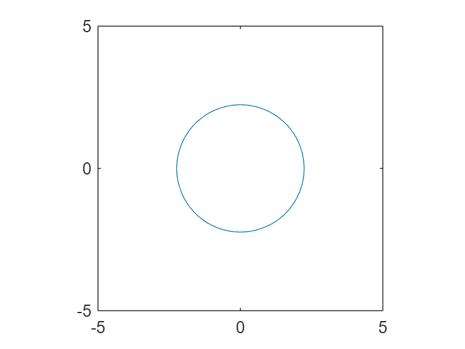

# MLX to markdown

a slight modification to [GitHub - minoue-xx/livescript2markdown](https://github.com/minoue-xx/livescript2markdown)

Running this script creates .md versions of this file and folders with images

## 1.1 Headings

### 1.1.1 Headings

Formatted text including **bold**, *italic,* underlined, `monospaced.`

For the formula  $z=x^2 +y^2$, with $z=5$

```matlab:Code
% a matlab code block
syms x y
z = x^2 + y^2
```

z = $$ x^2 +y^2 $$

```matlab:Code
f = z==5
```

f = $$ x^2 +y^2 =5$$

```matlab:Code

fprintf('The equation is %s',latex(f))
```

```text:Output
The equation is x^2+y^2=5
```

```matlab:Code

fprintf('and in latex format: $%s$',latex(f))
```

and in latex format: $x^2+y^2=5$

```matlab:Code

% plot
figure;
fimplicit(f,[-5 5]);
axis equal;
```



```matlab:Code

% a table
ysol = solve(f,y).';
x=(-2:2)';
y=subs(ysol,x);
tab1=table(x,y)
```

| |x|y}| |
|:--:|:--:|:--:|:--:|
|1|-2|-1      |1      |
|2|-1|-2      |2      |
|3|0|-5^(1/2)|5^(1/2)|
|4|1|-2      |2      |
|5|2|-1      |1      |

```matlab:Code
%  export to markdown, and also without code
addpath('mlx2md')
export("Example.mlx","Example.tex");
latex2markdown("Example");
```

```text:Output
Coverting latex to markdown is complete
Example.md
Note: Related images are saved in Example_images
```

```matlab:Code
%latex2markdown("Example",outputfilename="Example_nocode",hidecode=true);

% delete intermediate files
delete("Example.tex");
delete("matlab.sty");
```
