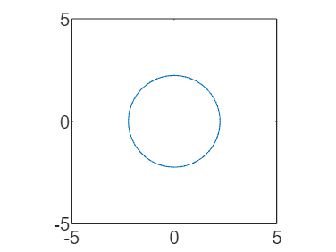

# MLX to markdown

a slight modification to [GitHub - minoue-xx/livescript2markdown](https://github.com/minoue-xx/livescript2markdown)

Running this script creates .md versions of this file and folders with images

## 1.1 Headings

### 1.1.1 Headings

For the formula  $z=x^2 +y^2$, with $z=5$

z = $$x^2 +y^2 $$

f = $$x^2 +y^2 =5$$

```text:Output
The equation is x^2+y^2=5
```

and in latex format: $x^2+y^2=5$



| |x|y}| |
|:--:|:--:|:--:|:--:|
|1|-2|-1      |1      |
|2|-1|-2      |2      |
|3|0|-5^(1/2)|5^(1/2)|
|4|1|-2      |2      |
|5|2|-1      |1      |
